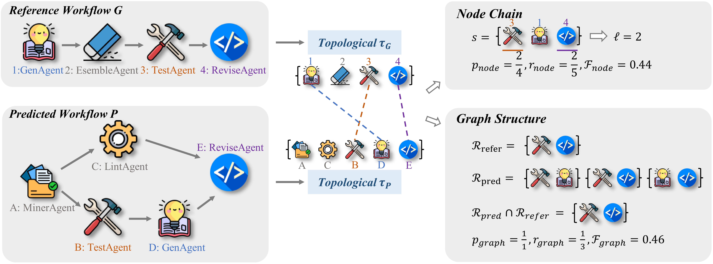
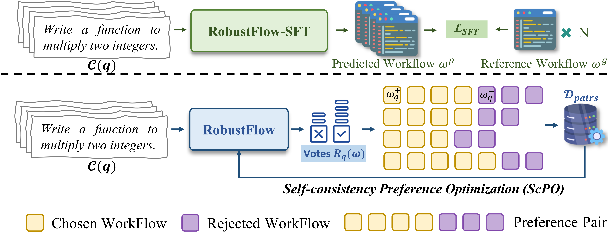
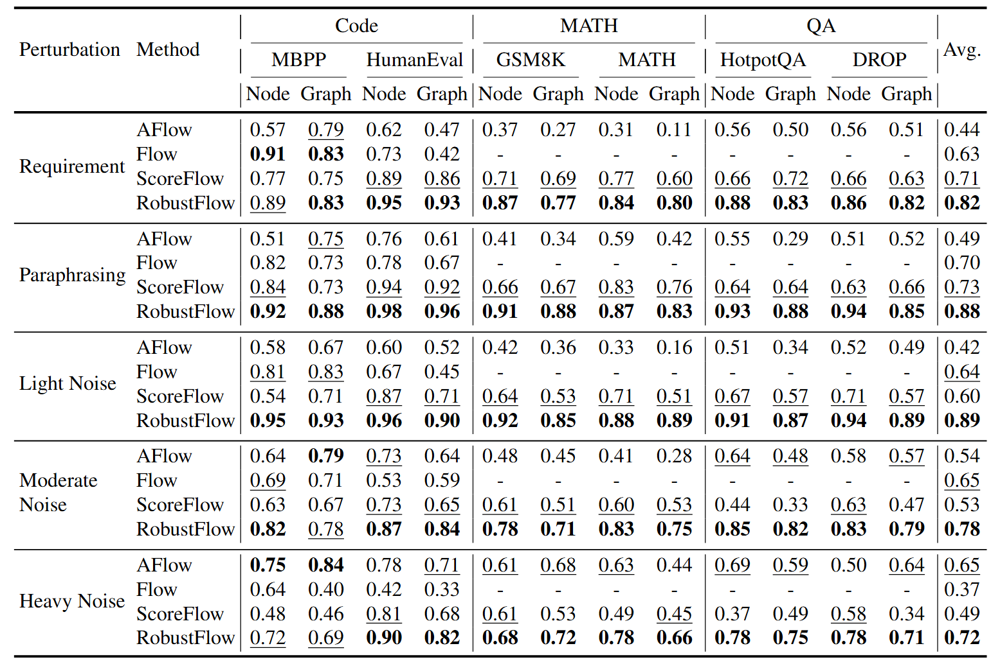

<div align="center">

# RobustFlow: Towards Robust Agentic Workflow Generation

[](https://arxiv.org/abs/2509.21834)
[](https://github.com/DEFENSE-SEU/RobustFlow/pulls)


[Shengxiang Xu (徐圣翔)*](https://xushengxianggg.github.io/), &nbsp; &nbsp; 
[Jiayi Zhang (张佳钇)*](https://didiforgithub.github.io/), &nbsp; &nbsp; 
[Shimin Di (邸世民)](https://sdiaa.github.io/)✉, &nbsp; &nbsp; 

[Yuyu Luo (骆昱宇)](https://luoyuyu.vip/)✉, &nbsp; &nbsp; 
[Liang Yao (姚亮)](https://1e12leon.top/), &nbsp; &nbsp; 
[Hanmo Liu (刘翰墨)](https://liuhanmo321.github.io/), &nbsp; &nbsp; 

[Jia Zhu (朱佳)](https://www.scholat.com/javaelf), &nbsp; &nbsp; 
[Fan Liu (刘凡)](https://multimodality.group/author/%E5%88%98%E5%87%A1/), &nbsp; &nbsp; 
[Min-Ling Zhang (张敏灵)](https://palm.seu.edu.cn/zhangml/), &nbsp; &nbsp; 

\* *Equal Contribution*
✉ *Corresponding Author*

</div>

> If you encounter any difficulties in using or reproducing the code, please get in touch with me directly (Email: xushx@seu.edu.cn, Wechat: 13270628738).

## Introduction

Welcome to the official repository of our paper "RobustFlow: Towards Robust Agentic Workflow Generation"!

The automated generation of agentic workflows is a promising frontier for enabling large language models (LLMs) to solve complex tasks. However, our investigation reveals that the robustness of agentic workflow remains a critical, unaddressed challenge. Current methods often generate wildly inconsistent workflows when provided with instructions that are semantically identical but differently phrased. This brittleness severely undermines their reliability and trustworthiness for real-world applications. 

To quantitatively diagnose this instability, we propose metrics based on nodal and topological similarity to evaluate workflow consistency against common semantic variations such as paraphrasing and noise injection. 



Subsequently, we further propose a novel training framework, RobustFlow, that leverages preference optimization to teach models invariance to instruction variations.



By training on sets of synonymous task descriptions, RobustFlow boosts workflow robustness scores to 70% - 90%, which is a substantial improvement over existing approaches.



## Quick Start

1. Setup the Python environment:

    ```bash
    conda create -n robustflow python=3.9
    pip install -r requirements.txt
    ```

2. Data Preparation

    You can download our [prepared datasets](https://drive.google.com/file/d/1OFcKegpBPSEdxy217tZHj2o9QWwnN6tJ/view?usp=drive_link) or reproduce them locally.

    - Place the official original file in the dataset folder (example: `noise_dataset/DROP/drop_original.jsonl`).

    - Run the rewrite script in that folder:

      ```bash
      cd noise_dataset/DROP/
      python rewrite_drop.py
      ```

      This generates:

      - `drop_paraphrasing.jsonl`
      - `drop_requirements.jsonl`
      - `drop_light_noise.jsonl`
      - `drop_moderate_noise.jsonl`
      - `drop_heavy_noise.jsonl`

    If you want to analyze the dataset, you can refer to the examples under `noise_dataset/Distribution/` and follow the steps below:

    ```bash
    cd noise_dataset/Distribution
    bash extract.sh
    ```

    This will generate dataset embeddings in the `embedding/` directory. To Analyze and visualize, you can either write your own script or use the provided ones:

    ```bash
    python analyze.py
    python draw.py
    ```

    These scripts compute statistics and clustering results from the embeddings, and generate distribution visualizations in the `visual/` directory.

3. Baseline Evaluation

   Clone the official repositories of [AFlow](https://github.com/FoundationAgents/AFlow), [ScoreFlow](https://github.com/Gen-Verse/ScoreFlow) and [Flow](https://github.com/tmllab/2025_ICLR_FLOW) into `AFlow/`, `Scoreflow/` and `Flow/`, and run each project strictly following its README to reproduce the baseline results as-is.

   - **AFlow Evaluation**

     ```bash
     cd evaluate/
     bash infer_aflow.sh
     python aflow_scripts/find.py
     python eval_aflow.py
     cat aflow_score.txt
     ```

   - **ScoreFlow Evaluation**

   - **Flow Evaluation**


4. Additional case studies are available in `samples/` for qualitative analysis.
4. 

## Citation

If you use RobustFlow in your research, please cite our paper:
```
@article{xu2025robustflow,
  title={RobustFlow: Towards Robust Agentic Workflow Generation},
  author={Xu, Shengxiang and Zhang, Jiayi and Di, Shimin and Luo, Yuyu and Yao, Liang and Liu, Hanmo and Zhu, Jia and Liu, Fan and Zhang, Min-Ling},
  journal={arXiv preprint arXiv:2509.21834},
  year={2025}
}
```

## Star History

[](https://www.star-history.com/#DEFENSE-SEU/RobustFlow&Date)
